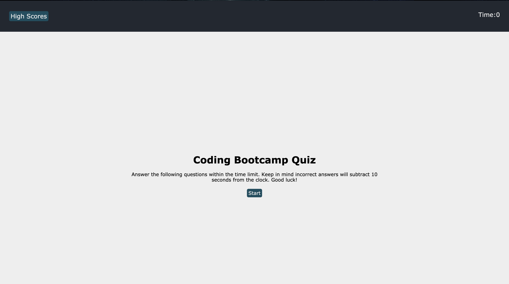
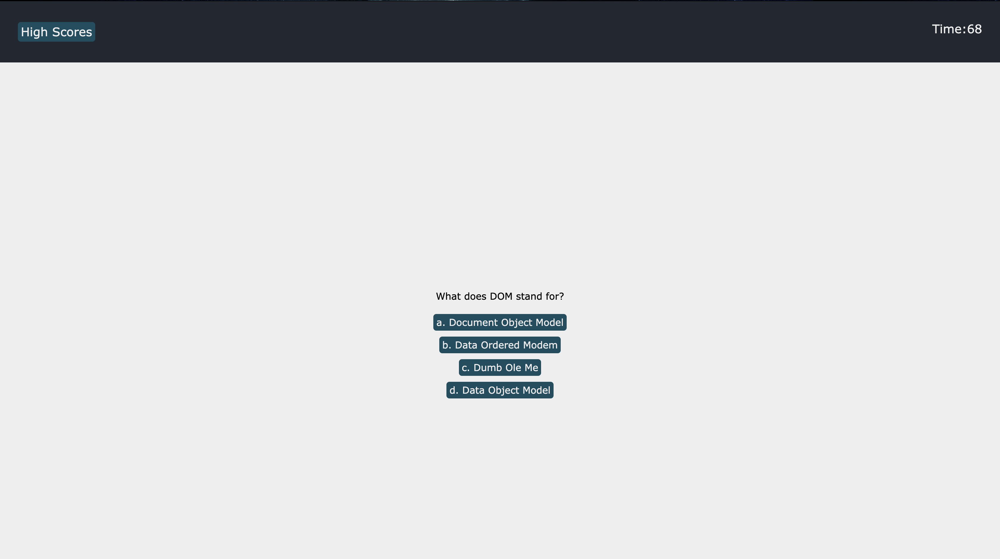
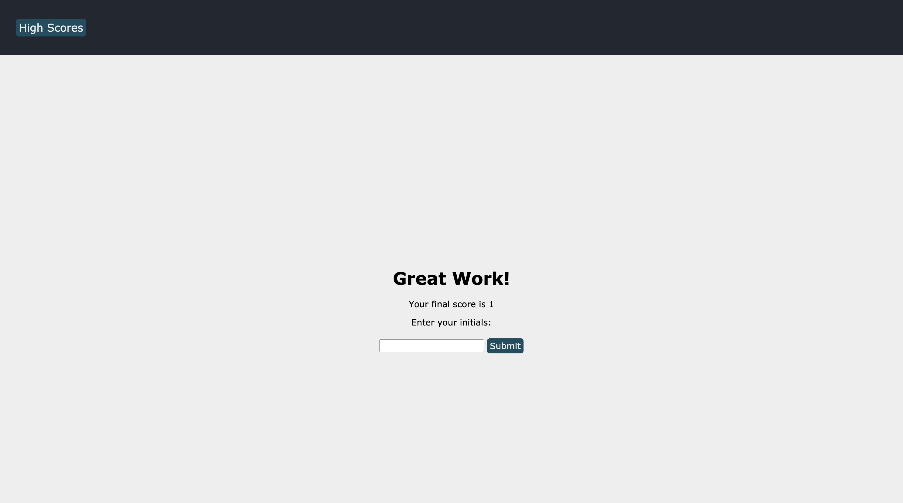
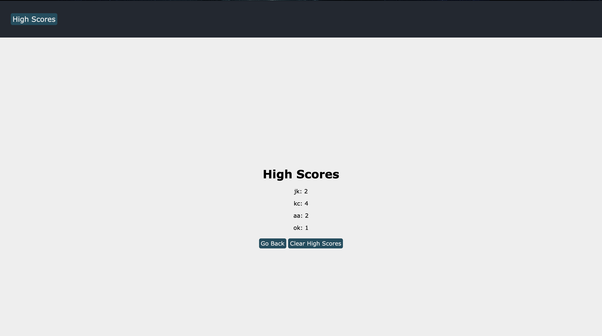

# Coding-Quiz

## Description

This application is a timed multiple-choice coding quiz. The webpage starts off with short info section that describes the rules of the game with a timer set to 0 and button that brings up a high score section. 

When the start button is clicked the user has 75 seconds to answer 6 questions. Correct answers add 1 point to the user's final score, and incorrect answers subtract 10 seconds from the timer and does not add to ther user's final score. When the user answers a question they are given feedback on whether they answered right or wrong. The quiz continues until the user has answer all the questions or the timer has reached 0.

At the end of the quiz the user is show their final score and is asked to submit their initials. When the user submits their initials their initials and high score are saved to local storage and will appear on the high scores section. The user can then clear all high scores saved to local storage or press a go back button which will take them to the beginning of the quiz where they are able to take the quiz again.

## Mock Up

The following images shows the various sections of the quiz:

Beginning:

Questions:

End Screen:

High Scores Page:

## Technologies Used

* HTML
* CSS
* JavaScript

## Links

GitHub: https://github.com/jkcanoy/Coding-Quiz

Live Page: https://jkcanoy.github.io/Coding-Quiz/
